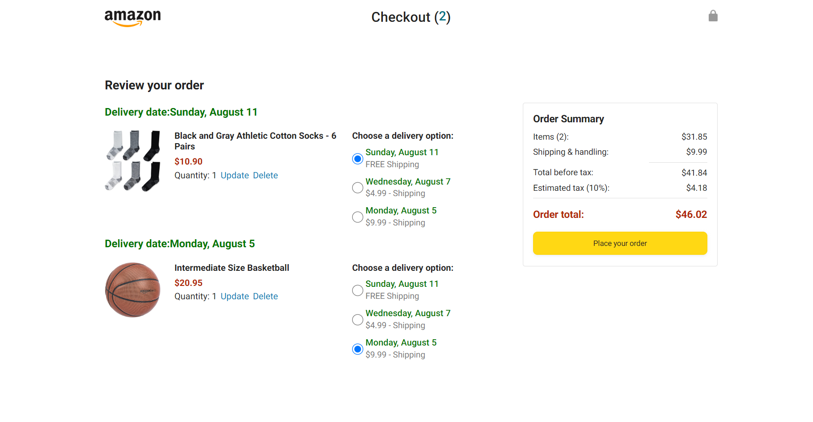

# Amazon Clone

## Description

This is an Amazon clone, a multipage e-commerce website that simulates a fully functional online shopping experience. The project includes pages for browsing products, managing the shopping cart, placing orders, and tracking packages.

## Table of Contents

- [Description](#description)
- [Features](#features)
- [Screenshots](#screenshots)
- [Installation](#installation)
- [Usage](#usage)
- [Technologies Used](#technologies-used)
- [Live Demo](#live-demo)
- [Contact Information](#contact-information)
- [License](#license)

## Features

- **Home Page**: Browse and add products to the cart.
- **Checkout Page**: View, update, and delete products in the cart; place orders.
- **Orders Page**: View all orders with details such as images, prices, and delivery dates; "Buy Again" and "Track Package" buttons.
- **Tracking Page**: View tracking information for the products ordered.
- **Responsive Design**: Optimized for various devices and screen sizes.

## Screenshots

_Home page displaying products_

_Checkout page with cart items_

_Orders page showing placed orders_

_Tracking page with tracking information_

## Installation

1. Clone the repository:

   git clone https://github.com/msrajput8894/Amazon-clone.git

2. Open the `index.html` file in your web browser.

## Usage

- **Home Page**: Browse or search products and add them to your cart.
- **Checkout Page**: Manage your cart items and place orders.
- **Orders Page**: View your order history and track packages.
- **Tracking Page**: Get real-time tracking updates for your orders.

## Technologies Used

- **Frontend**: HTML, CSS, JavaScript
- **Backend**: Fetch and XMLHttpRequest for data fetching
- **Version Control**: Git and GitHub
- **Hosting**: Netlify

## Live Demo

Visit the live site at: [Amazon Clone on Netlify](https://amazon-clone-by-mahendra-rajput.netlify.app/)

## Contact Information

- Email: [msrajput8894@gmail.com](mailto:msrajput8894@gmail.com)
- LinkedIn: [Mahendra Singh Rajput](https://linkedin.com/in/mahendrasing-rajput)
- Phone: +91 8208997720

## License

This project is licensed under the MIT License. See the [LICENSE](LICENSE) file for details.
